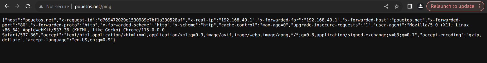

# TP4 devops

A project realized with Docker

## Installation

You need to clone this repository:
```sh
git clone https://github.com/ramenard/WIK-DPS-TP04.git
```

## Launching

It can be launch with the following command :

for the api:
```sh
kubectl port-forward pod/api -n tp 7777:8080
```

for the deployment:
```sh
kubectl port-forward deployment/api -n tp 4444:8080
```

for the replicaset:
```sh
kubectl port-forward replicaset/api -n tp 5555:2222
```

for the service:
```sh
kubectl port-forward service/my-service -n tp 5555:2222
```

```sh
kubectl apply -f manifest.yaml
```
Then go on the link : http://pouetos.net


